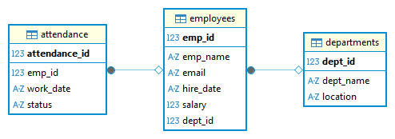

# Employee Management System – SQL Project

## Project Overview
This is a beginner-level SQL project that demonstrates an Employee Management
System using relational database concepts. The project includes table creation,
data insertion, and 20 SQL queries covering core SQL topics.

## Technologies/Tools Used
- SQL
- Dbeaver
- Notepad (for SQL scripting)

## Database Tables
- departments
- employees
- attendance

## Features
- Proper use of PRIMARY KEY and FOREIGN KEY
- 20 SQL queries covering:
  - SELECT, WHERE
  - JOINs
  - Sorting and filtering
  - GROUP BY, HAVING
  - Subqueries
  - Aggregate functions
- ER Diagram included
- Query output screenshots included

## How to Run the Project
1. Run `SQL_Scripts/create_tables.sql`
2. Run `SQL_Scripts/insert_data.sql`
3. Run `SQL_Scripts/queries.sql`

## ER Diagram

## Query Outputs
Screenshots of all 20 query outputs are available in the `Screenshots` folder.

## Author
Sanathkumar A
